<div align="center">

# SENTINEL

### Integrated Video Management and Analytics Platform

**One platform over every department's CCTV. Hand it a registration number; get back that vehicle's complete, timestamped, location-wise route across the camera network.**

Built for the [Gujarat Police Innovation Challenge 2026](https://sentinel.gujarat.gov.in/) · Home Department and the State Crime Records Bureau

[](https://www.python.org/)
[](https://fastapi.tiangolo.com/)
[](https://react.dev/)
[](https://leafletjs.com/)
[](https://onnxruntime.ai/)
[](https://github.com/PaddlePaddle/PaddleOCR)
[](https://www.sqlite.org/)
[](LICENSE)
[](#licensing-is-a-procurement-decision)

[**Technical proposal (HLD)**](deliverables/HLD.pdf) · [**Presentation**](deliverables/Sentinel-Solution-Presentation.pdf) · [**Architecture diagram**](deliverables/Sentinel-Workflow-Integration-Diagram.pdf) · [**API (OpenAPI 3.1)**](deliverables/registry-api.json) · [**Detection report**](deliverables/detection-report.html)

</div>

<!-- hero:start -->
<p align="center">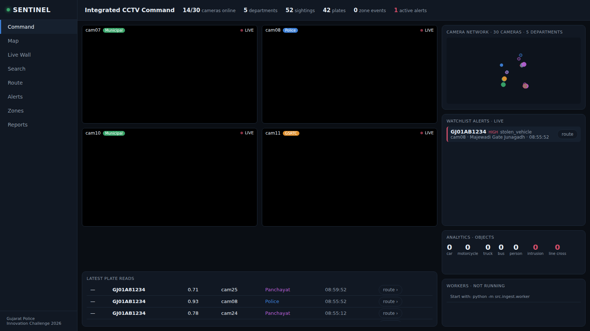</p>
<!-- hero:end -->

<div align="center"><sub>Command, live. The tiles are the organisers' sandbox cameras pulled over RTSP and a local feed from our own media server, in one viewer.</sub></div>

---

## At a glance

Gujarat runs CCTV across 26 government departments on systems that do not talk to each other: analog and IP cameras, different vendors and VMS platforms, storage in different places under different retention rules. Tracing one vehicle today means asking each department separately, by hand.

Sentinel puts one platform over those systems **without changing any of them**. It keeps a single camera registry with a GIS view, relays live video from different camera systems into one viewer, runs ANPR and video analytics continuously, checks every plate read against a watchlist, raises alerts automatically, and reconstructs a vehicle's movement across department boundaries from a single registration number.

**It is a working system, not a mock-up.** Every screen below reads the operational backend, and the analysed cameras are pulled live from the organisers' sandbox grid.

| | |
|---|---|
| **Proposed model** | **Model 1 + Model 2 + Pipeline 3 (hybrid)**: Model 1 (camera registry and GIS, mandatory) and Model 2 (unified viewing and metadata analytics), with event-triggered evidence capture (Pipeline 3) designed and validated separately. Model 3 (VMS federation) is the documented integration path. |
| **Cameras onboarded** | **58** across **5 departments**: the organisers' 30 sandbox cameras plus 28 local feeds from a second system |
| **Pulled live and analysed** | 5 sandbox cameras over RTSP, one pull each; the other 25 are viewed through the organisers' recording |
| **Analytics** | ANPR with OCR-tolerant matching, vehicle and person detection, within-camera tracking, intrusion zones, line crossing |
| **Detector / OCR** | YOLOX-S on ONNX Runtime (DirectML on the GPU) · PaddleOCR PP-OCRv5 mobile on the vehicle crop |
| **Runs on** | One laptop: GTX 1650 with 4 GB VRAM, 8 GB RAM |
| **Access** | Sign-in with roles (viewer, evaluator, admin), server-side sessions, an audit row naming the user for every change and every plate lookup |

---

## Measured on the live government feed

A formal 10-minute window on **25 September 2026, 14:18–14:28 IST**, after 10 minutes of warm-up, with five sandbox cameras pulled live over RTSP and analysed. All five were alive at the end with **zero restarts**. The evidence is committed: [`data/measurements/20260925-084754Z.md`](data/measurements/20260925-084754Z.md).

| Figure | Value |
|---|---|
| Peak GPU memory (YOLOX-S under DirectML, GTX 1650) | **119 MiB** `[measured]` |
| Peak RAM, API and worker together | **1,749 MB** `[measured]` |
| Sustained inference per camera | **0.6 – 1.5 fps** `[measured]` (cam06 0.67 · cam09 1.31 · cam26 0.6 · cam27 0.76 · cam28 1.47) |
| Motion-skip rate | 0.0 on the busy cameras, up to 0.54 on the quietest `[measured]` |
| Plate-read rate (full reads over vehicle tracks) | **0.062** overall, 12 of 195 `[measured]` |
| Line-crossing events fired on a live feed | **53** on cam06's carriageway, the same afternoon |

The binding stage on this hardware was OCR on the CPU, not the GPU. The plate-read rate is low because the sandbox cameras are wide overview units that put plates at 10 to 25 pixels; it is reported as measured rather than rounded up. Every other capacity figure in the documents is labelled `[model]` or `[estimate]`: the HLD never presents arithmetic as a measurement.

---

## The governing rule

**Video becomes permanent only where a specific, logged, auditable watchlist match justifies it.**

One stream pull per camera feeds three pipelines, and each has a different answer to *what does this keep?*

| Pipeline | What it does | What it persists | In the demonstrated system |
|---|---|---|---|
| **1. Live view** | Relays video to the control room | nothing: a self-overwriting 20-second relay window | **Built** |
| **2. Analytics** | Motion gate → detect → track → crop → OCR → watchlist match | a text sighting row and a plate crop of about 2 KB | **Built** |
| **3. Evidence** | Fixed-size rolling buffer per camera, promoted on a match | the promoted clip, its SHA-256 and an audit row | **Designed and validated separately, not built** |

Watching is not storing. This is a civil-liberties position before it is a storage optimisation, and it is also what makes the design affordable at 80,000 cameras: carrying raw video to one place would need about 240 Gbps; carrying a text row and a plate crop per read needs about 23 Mbps `[model]`.

---

## Architecture

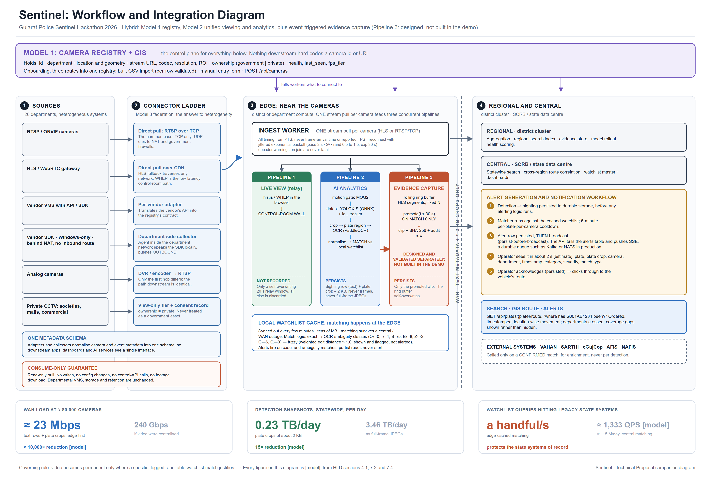

The **camera registry is the control plane.** Every camera's id, department, location, bearing and field of view, stream URL template (never a credential), codec, transport, tier and health lives there, and every other component asks it what to connect to. Nothing downstream hard-codes a camera id or a URL.

At statewide scale the same design splits across three tiers. Analytics runs at the **edge**, near the cameras, and matches plates against a locally cached watchlist, so only text and 2 KB crops cross the wide-area network. The **regional** tier aggregates, indexes and holds evidence; the **central** tier does statewide search, cross-region route correlation and enrichment against VAHAN, SARTHI, eGujCop, AFIS and NAFIS, called only on a confirmed match.

### Two different systems, one viewer

The Model 2 deliverable asks for a unified viewer over feeds from at least two different systems. Sentinel's Live Wall plays every registered camera through **one relay**, which picks the source per camera and labels it on the tile:

| Source | Used for | Tile badge |
|---|---|---|
| The analysing worker's own pull, teed into a 20-second window | the five analysed sandbox cameras, so viewing never costs a second pull | `LIVE · RTSP` |
| Our own media server (mediamtx, bound to `127.0.0.1`) | the 28 local feeds, the second system | `LOCAL FEED` |
| The organisers' CDN recording, relayed with a single-flight cache and a circuit breaker | the other 25 sandbox cameras | `CDN RECORDING` |

A recording is never labelled live. The browser never talks to a camera, the gateway or the media server directly: every byte goes through the authenticated relay.

### Integrating heterogeneous departments

| What the source exposes | Connector |
|---|---|
| RTSP or ONVIF | Direct pull, **RTSP over TCP** (UDP does not survive NAT or government firewalls) |
| HLS or WebRTC gateway | Direct pull over the CDN; this is how the sandbox's recordings are viewed |
| Vendor VMS with an API or SDK | Per-vendor adapter into the registry contract (Model 3) |
| SDK-only, Windows-only or behind NAT | Department-side collector that pushes outbound |
| Analog cameras | DVR or encoder, then RTSP |
| Private CCTV | View-only tier with a consent record, never treated as a government asset |

**Sentinel is consume-only.** It pulls each stream read-only and once, never publishes to a gateway, never calls a control API, never downloads stored footage and never writes to a departmental system. See [`deliverables/departmental-systems-unaffected.md`](deliverables/departmental-systems-unaffected.md).

---

## The platform, live

Captured from the running platform on the laptop, with the live tiles playing.

<!-- gallery:start -->
<table>
<tr><td width="50%" valign="top">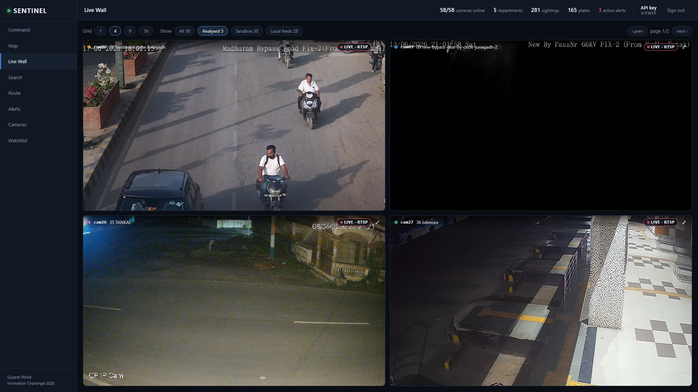<br><sub><b>Live Wall: the government feed.</b> The analysed sandbox cameras, each pulled live over RTSP once and relayed from the worker's own 20-second window (<code>LIVE · RTSP</code>).</sub></td><td width="50%" valign="top">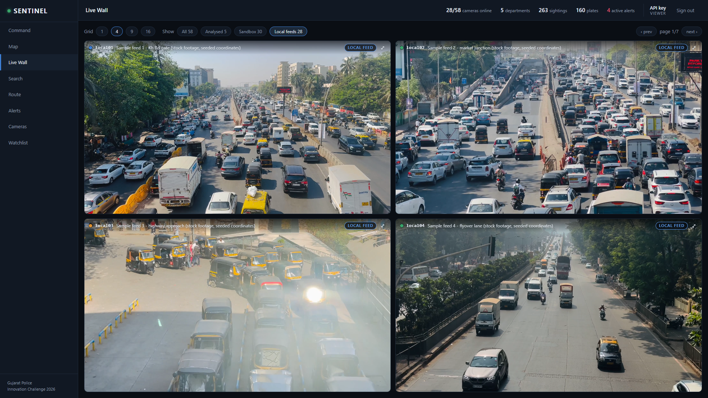<br><sub><b>Live Wall: the second system.</b> 28 local feeds from our own media server, stock traffic clips at seeded coordinates and labelled as such (<code>LOCAL FEED</code>), in the same viewer.</sub></td></tr>
<tr><td width="50%" valign="top">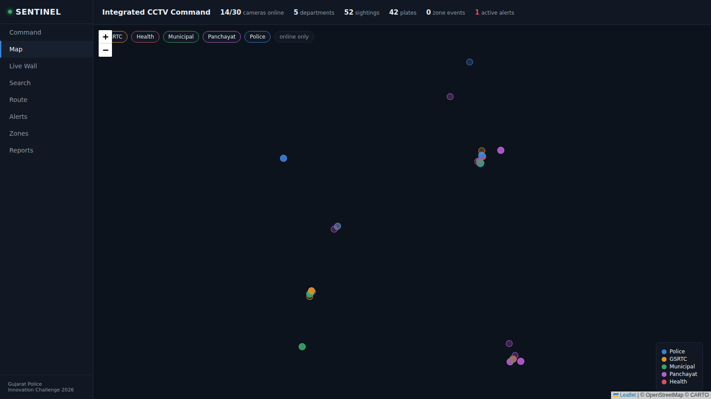<br><sub><b>Map.</b> Every camera by department, clustered below street zoom with each cluster's department share; the analysed ring, health, 24-hour activity and coverage gaps as layers.</sub></td><td width="50%" valign="top">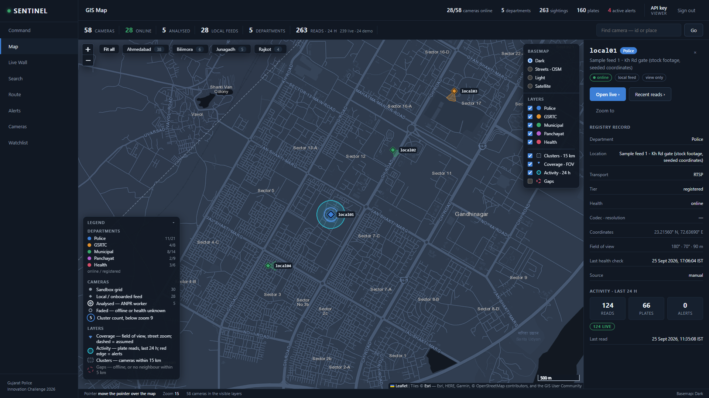<br><sub><b>Map at street zoom.</b> Field-of-view wedges and the camera's registry record, with its 24-hour activity split into live and demonstration reads.</sub></td></tr>
<tr><td width="50%" valign="top">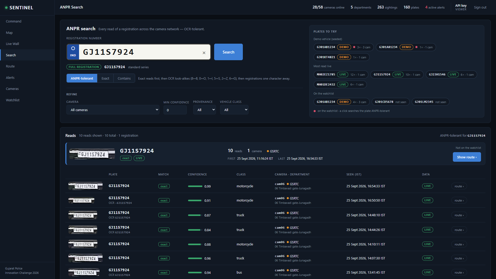<br><sub><b>ANPR search.</b> A plate read live from the government feed: every read with its crop, confidence, vehicle class, camera and time, each marked <code>LIVE</code>.</sub></td><td width="50%" valign="top">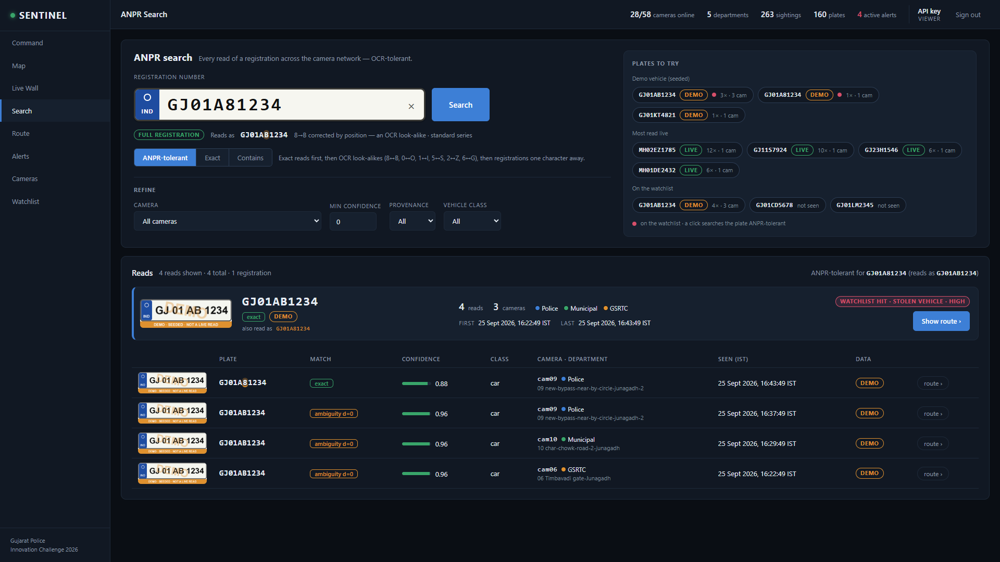<br><sub><b>OCR-tolerant search.</b> <code>GJ01A81234</code> still finds <code>GJ01AB1234</code> (8 and B look alike to OCR): the labelled demonstration vehicle, badged <code>DEMO</code>, with its watchlist hit.</sub></td></tr>
<tr><td width="50%" valign="top">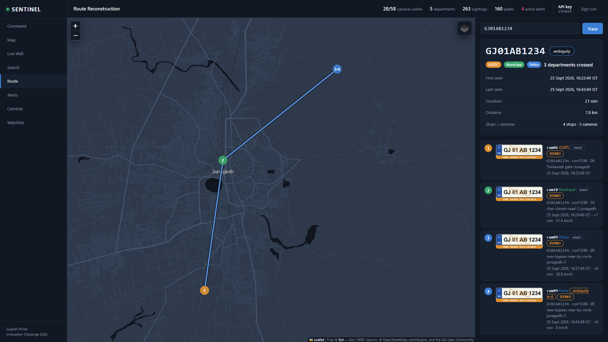<br><sub><b>Route: the scored capability.</b> <code>GJ01AB1234</code>, the labelled demonstration vehicle: numbered stops across three cameras and three departments, with times, speeds and the OCR near-miss it still matched.</sub></td><td width="50%" valign="top">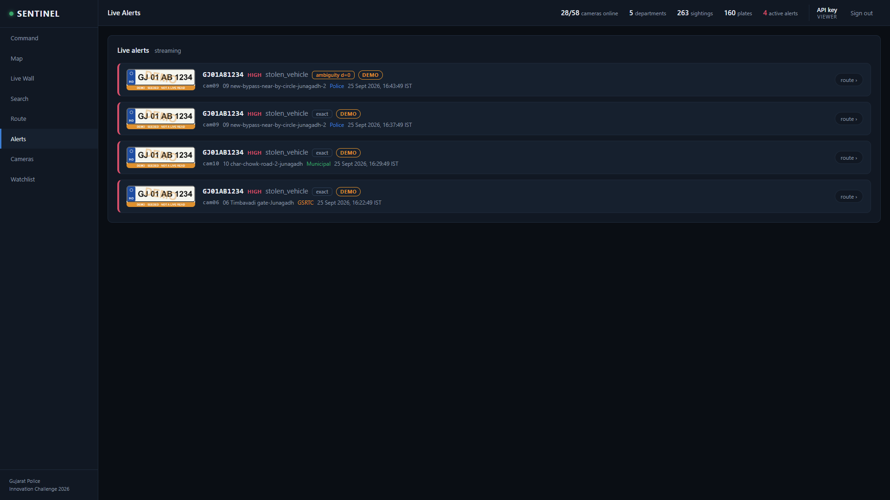<br><sub><b>Alerts.</b> Pushed over Server-Sent Events from the alerts table: plate crop, severity, category, match type, camera and department. These are the demonstration vehicle's, badged <code>DEMO</code>.</sub></td></tr>
<tr><td width="50%" valign="top">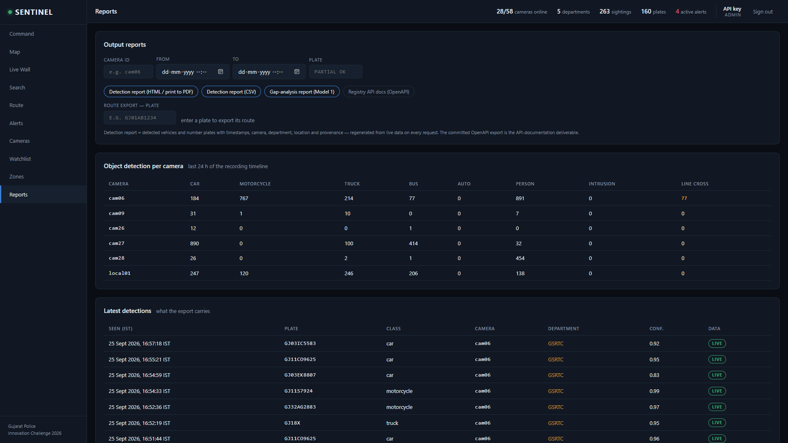<br><sub><b>Reports.</b> The timestamped detection report (HTML or CSV), the gap-analysis report and the route export; object counts per camera; the latest live detections with their provenance.</sub></td></tr>
</table>
<!-- gallery:end -->

---

## Try it in five minutes

The hosted URL and the evaluator credentials are on the **submission form**; they are never written into this repository. For Chrome, see the note below.

1. **Command.** The *Start here* panel says what the platform is, which plates to try, where every feed comes from, and which rows are demonstration data.
2. **Route.** Type `GJ01AB1234`: the labelled demonstration vehicle's route across three cameras in three departments, with timestamps, implied speeds and the OCR near-miss it still matched. Every stop is badged `DEMO`.
3. **Search.** Pick a plate from *Plates to try → Most read live*: real reads from the live pipeline with their crops. Then type `GJ01A81234` and watch the OCR-tolerant match find `GJ01AB1234`.
4. **Live Wall.** Switch between *Analysed*, *Sandbox* and *Local feeds*: two different camera systems in one viewer.
5. **Map.** Zoom from the state to a street: department clusters, field-of-view wedges, activity, coverage gaps; click a camera for its registry record.
6. **Alerts, Watchlist, Reports.** The alert stream the watchlist drives, and the detection report with timestamps and a provenance column, as HTML or CSV.

> **Use Google Chrome.** Six sandbox cameras, cam06 among them, are H.265. Chrome decodes them in the browser; some Edge installations cannot, and the tile says so rather than going blank.

---

## What is demonstration data, stated up front

- **The demonstration vehicle.** `GJ01AB1234` is injected through the *real* sighting → match → alert path with `provenance='demo'`, because no real vehicle crosses several sandbox cameras. It is badged `DEMO` on every screen, watermarked on its plate crops and carried in every export. A demonstration row never passes as a live read.
- **Seeded geography.** The organisers' catalogue carries only an id and a name per camera. The sandbox cameras' departments and coordinates are seeded assignments ([`data/camera_seed.csv`](data/camera_seed.csv)), stated in every export.
- **The local feeds.** `local01`–`local28` are 28 stock traffic clips, looped on our own media server at seeded Ahmedabad and Gandhinagar coordinates. They are not sandbox footage and were not filmed by the team; every registry row says so. They are view-only on the platform database, because a looped clip analysed there would count one vehicle once per loop. Reads kept from `local01`'s analysed run in the 24 September end-to-end walkthrough carry that camera id: they are real reads of a looped clip, so a vehicle there can be counted once per pass.
- **The active tier.** Five sandbox cameras are analysed continuously, within the laptop's GPU and the gateway's session limit; the others are registered and viewed.

---

## How the analytics work

### ANPR

```
RTSP pull (TCP, one per camera, timed by PTS)
  -> motion gate (MOG2; a static frame never reaches the detector)
  -> vehicle detection (YOLOX-S, ONNX Runtime, DirectML)
  -> IoU + centre tracker (velocity from PTS deltas, never wall clock)
  -> vehicle crop, never the full frame
  -> super-resolve (cubic upscale to ~400 px, CLAHE)
  -> OCR (PaddleOCR PP-OCRv5 mobile) -> consensus vote across a track's reads
  -> position-aware coercion to the Indian plate grammar (O->0, I->1, S->5, B->8, Z->2, G->6, Q->0)
  -> sighting row + ~2 KB crop, deduplicated at 60 s per plate per camera
```

A read is **full** when its coerced form matches the standard series (state code, district, one to three series letters, four digits) or the BH series. The raw OCR text is kept beside the coerced plate, so a normalisation change can be replayed.

### Watchlist matching

Matching runs **locally against a cached watchlist**, refreshed every ~10 seconds, and never makes a round trip per detection. At 80,000 cameras that round trip would be about 1,333 queries a second against state systems of record `[model]`.

1. **Exact** on the canonical plate.
2. **OCR ambiguity**: the same plate once look-alike characters are folded (`GJ01A81234` is `GJ01AB1234`).
3. **Fuzzy**: registrations one character away, limited to entries sharing the first four canonical characters. Shown and flagged; they raise an alert only if `SENTINEL_ALERT_ON_FUZZY=true`.

Partial reads never alert. Every alert records its match type and distance.

### The alert path

The ordering is deliberate, and it is the part most worth reading in the source ([`backend/core/alerts.py`](backend/core/alerts.py)):

1. The sighting row is committed to durable storage **before** any alerting logic runs.
2. The matcher runs against the cached watchlist, with a five-minute cooldown per plate per camera derived from the alerts table itself, never from process memory.
3. The alert row is committed **and then** broadcast: the API tails the table and pushes Server-Sent Events, so a detection never exists only in the memory of a process about to crash.
4. The operator sees plate, crop, camera, department, severity and match type, acknowledges it (persisted, audited) and clicks through to the route.

In production step 3 is a durable queue such as Kafka or NATS. That difference is stated, not glossed over.

### Route reconstruction

`GET /api/plates/{plate}/route` returns ordered stops with camera, department, coordinates, timestamp, crop and match type; elapsed time and implied speed between stops; total distance and duration; the departments crossed; and coverage gaps. Stops are grouped by the clock that produced them, and speed is computed only within one clock, so a route can never show an impossible speed stitched across two time bases.

### Zones and objects

Intrusion polygons and crossing lines are stored per camera in normalised 0–1 coordinates, so they survive a resolution change. A zone fires only after the tracked object's foot point is confirmed inside on two consecutive sampled frames, so one bad box cannot put a false intrusion in front of an operator. High-severity zone hits raise alerts. Object events are throttled to one per camera per class per 5 seconds of stream time and aggregated for Command and the reports.

---

## Security

- **Nothing is reachable without signing in** except the login page, the health check and the static assets. Only the API port is published; the media server and the development server stay on `127.0.0.1`.
- **Passwords exist only as scrypt hashes** with a per-user salt, set by an administrator's command-line tool that prompts for them. Sessions are server-side, in `HttpOnly`, `SameSite=Strict` cookies (`Secure` when published), expiring after 8 hours and revoked on logout or password change. Five failed sign-ins lock the name or address for 15 minutes, and the lock survives a restart.
- **Roles.** `viewer` reads; `evaluator` also acknowledges alerts, edits the watchlist, runs reports and onboards a view-only camera; `admin` does everything, including users, bulk import and zones.
- **Audit.** An append-only table names the user for every onboarding, edit and import, every watchlist change, acknowledgement, zone edit and sign-in, and every plate lookup, search and route export.
- **Credentials come from the environment only.** They are never hard-coded, logged, persisted or returned, and the registry stores URL templates whose placeholders are filled in memory, only for the organisers' gateway host. No credential is in this repository or its history; the sweep is recorded in [`docs/submission-checklist.md`](docs/submission-checklist.md).
- **Hardened headers**: a strict Content-Security-Policy naming each map tile host exactly, HSTS when published, `X-Content-Type-Options`, `Referrer-Policy: no-referrer` and frame denial.

---

## Engineering evidence

| | |
|---|---|
| **Automated tests** | **360** pytest cases, 0 failing; **92** browser assertions against the real API (`scripts/smoke_frontend.py`); **31** real-browser playback assertions that prove video actually plays through the relay (`scripts/smoke_playback.py`). All run on the laptop on 25 September 2026 |
| **Review gate** | A security and correctness review of the final day's changes: 19 findings, 17 confirmed and fixed, each with a regression test, 2 refuted. The critical one was a path traversal through the relay that is now closed and tested |
| **A test for every bug** | The build's standing rule: a fix ships with the test that reproduces the defect |
| **Decisions** | 84 recorded design decisions, each with its reason ([`docs/decisions.md`](docs/decisions.md)) |
| **Build log** | Every session's observations, measurements and surprises ([`docs/progress.md`](docs/progress.md)) |

---

## Run it yourself

**Needs:** Windows 10 or 11 · Python 3.13 · Node 20.19+ (first start only, to build the frontend) · 8 GB RAM · an NVIDIA GPU is used through DirectML when present, otherwise the detector runs on the CPU · a sandbox portal account.

```bat
git clone https://github.com/adityashroff06-code/sentinel-gujarat.git
cd sentinel-gujarat

copy .env.example .env          :: fill in SENTINEL_EMAIL, SENTINEL_PASSWORD and the two API keys
python launch.py start          :: doctor, venv, ffmpeg, models, probe, seeds, frontend, feeds, API + worker
.venv\Scripts\python -m backend.tools.users add <name> --role admin     :: prompts for the password
```

Then open `http://127.0.0.1:8000/` in Chrome and sign in. Later starts skip everything already done.

| Command | What it does |
|---|---|
| `python launch.py start` | Full bring-up, then opens the platform |
| `python launch.py check` | Report what is present and what is missing, change nothing |
| `python launch.py status` | Workers, database counts, whether `:8000` answers, `feeds: N/28` |
| `python launch.py demo` | Inject the labelled demonstration vehicle through the real pipeline |
| `python launch.py demo-clear` | Remove exactly the demonstration rows, leaving live reads untouched |
| `python launch.py replay-start` | Restart the local feeds on the media server |
| `python launch.py measure --minutes 10` | The live measurement window behind the table above |
| `python launch.py stop` | Graceful stop, then only the process trees it started |

<details>
<summary><b>Troubleshooting</b></summary>

| Symptom | What to do |
|---|---|
| `status` shows fewer than `feeds: 28/28` | `python launch.py replay-start` |
| A tile says the browser cannot decode HEVC | Open the page in Google Chrome |
| *Organisers' CDN not answering* or *Feed reconnecting* | The sandbox is down or rate-limiting; the relay backs off and the tiles recover on their own |
| *Local feed offline* | `python launch.py replay-start` |
| *Too many open streams — slowing down* | Use the default 4-up grid; the relay is rate-limiting this browser |
| *Session expired — sign in again* | Sessions last 8 hours |
| Sign-in refused after five failures | Locked for 15 minutes by design |
| Anything else | `data/logs/` holds one rotating log per process |

</details>

<details>
<summary><b>Configuration</b> (<code>.env</code>, gitignored; <code>.env.example</code> is the template)</summary>

| Variable | Default | Meaning |
|---|---|---|
| `SENTINEL_EMAIL`, `SENTINEL_PASSWORD` | | Sandbox portal account, raw values; percent-encoded in code, never logged or returned |
| `SENTINEL_API_KEY_ADMIN`, `SENTINEL_API_KEY_VIEWER` | | Keys for scripts and tools; the API refuses to start without them |
| `SENTINEL_PUBLIC_HOST` | | The published hostname; switches on trusted-host checking, `Secure` cookies and HSTS |
| `SENTINEL_CDN`, `SENTINEL_STREAM_IP`, `SENTINEL_RTSP_PORT` | sandbox values | The organisers' endpoints |
| `SENTINEL_ACTIVE_CAMERAS` | `6` | Cap on concurrent stream pulls |
| `SENTINEL_INFER_FPS` | `3` | Frames sampled per second per analysed camera |
| `SENTINEL_ALERT_ON_FUZZY` | `false` | Exact and ambiguity matches alert; fuzzy only when true |
| `SENTINEL_DB` | `data/sentinel.db` | SQLite in WAL mode for the demo; production substitutes Postgres |
| `SENTINEL_HEALTH_INTERVAL_S` | `300` | Camera health-check cadence |

</details>

---

## API

The OpenAPI document FastAPI generates **is** the registry API deliverable: served at `/docs` (signed in) and exported to [`deliverables/registry-api.json`](deliverables/registry-api.json), 35 paths.

<details>
<summary><b>Registry (Model 1)</b></summary>

| Method | Path | Purpose |
|---|---|---|
| `GET` | `/api/cameras` | Cameras, filterable by department, tier and health, with free-text search |
| `POST` | `/api/cameras` | Onboard one camera |
| `POST` | `/api/cameras/import` | Bulk CSV import, validated row by row with a reason for every rejection |
| `GET` `PATCH` | `/api/cameras/{camera_id}` | One camera record; update it, zones included |
| `GET` | `/api/cameras/{camera_id}/stream` | The playable URL: always the platform's relay path, never an upstream URL |
| `GET` | `/api/cameras/gap-analysis` | Offline and degraded cameras, and isolated coverage |
| `GET` | `/api/cameras/activity` | Reads, plates, alerts and last seen per camera, split by provenance |

</details>

<details>
<summary><b>Analytics and investigation (Model 2)</b></summary>

| Method | Path | Purpose |
|---|---|---|
| `GET` | `/api/sightings` | Plate reads; `match=exact`, `contains` or `anpr` (exact, then OCR ambiguity, then fuzzy) |
| `GET` | `/api/plates/{plate}/route` | **The scored capability**: ordered, timestamped, location-wise stops |
| `GET` | `/api/plates/suggest` | Plates worth trying: demonstration, watchlist and most-read live |
| `GET` | `/api/events`, `/api/events/summary` | Zone and object events; counts per camera per class |
| `GET` | `/api/workers` | Per-camera fps, motion-skip rate and read counts |

</details>

<details>
<summary><b>Watchlist and alerting</b></summary>

| Method | Path | Purpose |
|---|---|---|
| `GET` `POST` | `/api/watchlist` | The watchlist; add an entry with category and severity |
| `DELETE` | `/api/watchlist/{watchlist_id}` | Remove an entry |
| `GET` | `/api/alerts` | Alert history |
| `GET` | `/api/alerts/stream` | Live alerts over Server-Sent Events |
| `POST` | `/api/alerts/{alert_id}/ack` | Acknowledge; persisted and audited |

</details>

<details>
<summary><b>Relay, reports, access and service</b></summary>

| Method | Path | Purpose |
|---|---|---|
| `GET` | `/api/hls/{camera_id}/live.m3u8` | The relayed playlist for a tile, from the source the relay picked |
| `GET` | `/api/hls/{camera_id}/source` | Which source a camera plays from right now |
| `GET` | `/api/reports/detections` | Timestamped detection report, HTML or CSV, with provenance |
| `GET` | `/api/reports/route/{plate}` | Route export |
| `GET` | `/api/reports/gap-analysis` | Coverage gap report |
| `POST` | `/api/auth/login`, `/api/auth/logout` | Sign in and out |
| `GET` `POST` `PATCH` `DELETE` | `/api/users` | Accounts (admin) |
| `GET` | `/api/health`, `/api/stats` | Liveness; counts across the platform |

</details>

---

## Design decisions worth knowing

These are summarised here and argued properly in [the HLD](deliverables/HLD.pdf).

**Timing comes from PTS, never from frame arrival.** On connect the gateway replays a buffered group of pictures, so early frames arrive faster than real time. Anything timed by arrival computes impossible vehicle speeds, and the bug then looks like a model problem and is debugged in the wrong place.

**One stream pull per camera, fanned out internally.** Each connected client receives its own copy of the stream, so a second pull costs the department bandwidth. The worker's pull feeds analytics and the Live Wall both.

**RTSP over TCP, always**, with jittered exponential backoff on reconnect (base 2 s, cap 30 s, multiplied by a random 0.5 to 1.5). Without jitter a regional power event turns every recovering client into a synchronised reconnect storm against departmental recorders.

**Store crops, not frames.** A full-frame snapshot per read is about 30 KB, 3.46 TB a day statewide; a plate crop is about 2 KB, 0.23 TB `[model]`.

**Decode binds before inference.** A GPU's NVDEC engines cap out at roughly 20 to 40 concurrent 1080p30 sessions `[estimate]`. Tuning inference to 200 streams per GPU while decode caps at 30 leaves the tensor cores about 85% idle `[model]` and sizes the fleet on the wrong number.

**Measured and modelled are labelled separately.** Exactly six figures in the HLD are `[measured]`, all from the live window above; everything else is `[model]` or `[estimate]`.

### Licensing is a procurement decision

At 80,000 cameras a licence at ₹500 per camera per year is ₹4 crore a year. The model and library stack linked into Sentinel is Apache-2.0, MIT and BSD throughout: YOLOX, PaddleOCR, ONNX Runtime, FastAPI, React, Leaflet (BSD-2), hls.js. mediamtx (MIT) and ffmpeg run as separate processes, never linked. That means **not** Ultralytics YOLO, which is AGPL-3.0 and, linked into an application the State would own, can pull the whole codebase under AGPL; and not Elasticsearch or Redis under their current licences, for which OpenSearch and Valkey are the production substitutes.

---

## What this does not do

Stated here so nobody has to discover it.

- **No evidence clips in the demonstrated system.** Pipeline 3 is designed and validated separately and is not built; no video is kept beyond the 20-second relay window.
- **No Model 3 federation demonstration.** The sandbox exposes bare stream endpoints, with no departmental VMS inside it to federate.
- **No facial recognition.** The approach and its privacy controls are described in HLD §5.4; it is not built and not claimed.
- **No real vehicle crossing several sandbox cameras.** The multi-camera route shown is the labelled demonstration vehicle; the harvest of the organisers' recordings was cut.
- **Plate recall on these feeds is limited, and reported as such.** Wide overview cameras put plates at 10 to 25 pixels; the measured plate-read rate is 0.062.
- **The 30 versus 50 camera discrepancy is recorded, not resolved silently.** The problem statement refers to about 50 cameras; the catalogue after login lists 30 (HLD Appendix A).

---

## Submission deliverables

| Deliverable | Location |
|---|---|
| Solution presentation | [`Sentinel-Solution-Presentation.pdf`](deliverables/Sentinel-Solution-Presentation.pdf), [`.pptx`](deliverables/Sentinel-Solution-Presentation.pptx) (generated by [`deck/build_deck.js`](deliverables/deck/build_deck.js)) |
| Technical proposal (HLD): the eight required elements and the ten dimensions | [`HLD.pdf`](deliverables/HLD.pdf), source [`HLD.md`](deliverables/HLD.md) |
| Workflow and integration diagram | [`.pdf`](deliverables/Sentinel-Workflow-Integration-Diagram.pdf), [`.svg`](deliverables/Sentinel-Workflow-Integration-Diagram.svg), [`.png`](deliverables/Sentinel-Workflow-Integration-Diagram.png) |
| Registry API documentation | [`registry-api.json`](deliverables/registry-api.json) (OpenAPI 3.1), live at `/docs` |
| Sample onboarded camera dataset | [`sample-camera-dataset.csv`](deliverables/sample-camera-dataset.csv) |
| Gap-analysis report | [`gap-analysis-report.html`](deliverables/gap-analysis-report.html) |
| Timestamped detection report | [`detection-report.html`](deliverables/detection-report.html), [`.csv`](deliverables/detection-report.csv) |
| Route export of the demonstration vehicle | [`route-GJ01AB1234.html`](deliverables/route-GJ01AB1234.html), [`.csv`](deliverables/route-GJ01AB1234.csv) |
| Departmental systems unaffected (Model 2 note) | [`departmental-systems-unaffected.md`](deliverables/departmental-systems-unaffected.md) |
| Built frontend | [`frontend-dist.zip`](deliverables/frontend-dist.zip) |
| Demo videos and the hosted URL | on the submission form |

---

## Repository layout

```
launch.py                 one-command bring-up, status, demo control, measurement
backend/
  app/                    FastAPI: auth + sessions, registry, analytics, HLS relay, reports, users, audit
  core/                   config, database + migrations, plates, matcher, alerts, timeline, CDN session
  services/               route reconstruction, ANPR search, gap analysis, health checker, reports
  tools/                  probe, seed registry + watchlist, demo seeder, users, OpenAPI export
ml/
  ingest/                 RTSP pull (PTS timing, tee, watchdog, backoff), replay source
  anpr/                   motion gate, YOLOX-S detector, tracker, OCR cascade, sightings
  analytics/              zones and line crossing, object events
  supervisor.py           one worker per active camera, single database writer, hot reload
frontend/src/             React 18 + Vite: Command, Map, Live Wall, Search, Route, Alerts,
                          Cameras, Watchlist, Zones, Reports, Login
deliverables/             everything submitted
data/                     catalogue, probe results, camera seed, local-feed register, measurements
docs/                     design record, API contract, decisions, plan, build log, runbooks
scripts/  tests/          smoke tests, feed tools, document renderers; the pytest suite
```

How the build itself is run is in [`docs/sessions.md`](docs/sessions.md).

---

## Licence

Apache License 2.0. See [LICENSE](LICENSE). Never commit `.env`.
